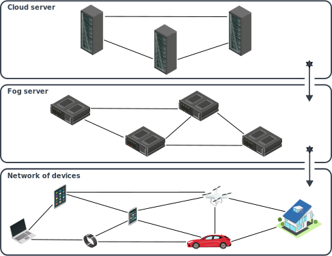
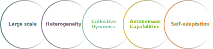
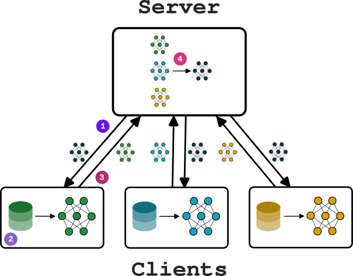
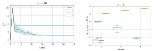
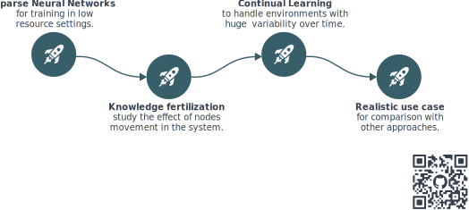

+++

title = "Guide for writing markdown slides"
description = "A Hugo theme for creating Reveal.js presentations"
outputs = ["Reveal"]
aliases = [
    "/guide/"
]

+++

# Towards Self-Adaptive Cooperative Learning in Collective Systems

[Davide Domini](mailto:davide.domini@unibo.it), PhD student

International Conference on Autonomic Computing and Self-Organazing Systems @ DOCTORAL SYMPOSIUM ACSOS 2024

 

---

# Scenario

<!-- 

 -->

 

<!--  -->

<!--  -->

<!-- {} -->

<!-- <h3> Main characteristics </h3>

<!-- 

 <i class="fa-solid fa-angle-right" style="color: #22373b;"></i> Large scale 

 <i class="fa-solid fa-angle-right" style="color: #22373b;"></i> Heterogeneity 

 <i class="fa-solid fa-angle-right" style="color: #22373b;"></i> Collective dynamics 

 <i class="fa-solid fa-angle-right" style="color: #22373b;"></i> Autonomous capabilities 

 <i class="fa-solid fa-angle-right" style="color: #22373b;"></i> Self-adaptation 

-->
<!-- {}  -->
<!--  -->

<!--  -->

--- 

# Motivation

 **Computing devices** are more and more *ubiquitous* in every day life, enabling lots of *potential applications*,   such as: crowd monitoring, smart surveillance, air quality monitoring, and many more.

















--- 

# Challenges

 <i class="fa-solid fa-xmark" style="color: red;"></i> These system are <em>complex</em>, engineering <em>collective behaviors</em> is a non trivial task 

 <i class="fa-solid fa-xmark" style="color: red;"></i> <em>Laws</em> put more <em>constraints</em>, for instance GDPR in europe for privacy 

 <i class="fa-solid fa-xmark" style="color: red;"></i> <em>Heterogeneity</em> emerges both in the devices and the data generated by them 

--- 

# Methodology

 <i class="fa-solid fa-angle-right" style="color: #22373b;"></i> Identify <em>learning paradigms</em> that well adapt to our scenario

 <i class="fa-solid fa-angle-right" style="color: #22373b;"></i>  Identify <em>key challenges</em> in Federated Learning and Collective Systems   through a literature review 

 <i class="fa-solid fa-angle-right" style="color: #22373b;"></i> Design of <em>custom Federated Learning algorithms</em> based on macroprogramming   (in particular, aggregate computing) abstractions 

---

# Federated Learning





  

  

  

  
 <i class="fa-solid fa-check" style="color: green;"></i> Reduces privacy concerns 

  
 <i class="fa-solid fa-xmark" style="color: red;"></i> Single point of failure 

  
 <i class="fa-solid fa-xmark" style="color: red;"></i> Need for a central trusted entity 

  
 <i class="fa-solid fa-xmark" style="color: red;"></i> Heterogeneity 

  

  

  

  

  

  
 <i class="fa-solid fa-check" style="color: green;"></i> No single point of failure 

  
 <i class="fa-solid fa-check" style="color: green;"></i> No need for a central trusted entity 

  
 <i class="fa-solid fa-xmark" style="color: red;"></i> Communication overhead 

  
 <i class="fa-solid fa-xmark" style="color: red;"></i> Heterogeneity 

  

  

  





---

# Why Aggregate Computing?

--- 

# Preliminary results

 <b> Field-based Coordination for Federated Learning</b><small>[1]</small> 

 Goals: 

 <i class="fa-solid fa-angle-right" style="color: #22373b;"></i> Implement peer-to-peer FL through AC abstractions and perform a   comparison with centralized FL under IID data 

 <i class="fa-solid fa-angle-right" style="color: #22373b;"></i> Implement clustered FL with AC using only geographical proximity   based policies 

 
 

<small style="text-align: left"> 
[1] Domini D., Aguzzi G., Esterle L., Viroli M. "Field-based Coordination for Federated Learning." Coordination 2024. 
[2] Domini D., Farabegoli N, Aguzzi G., Viroli M., Esterle L. "Proximity-based Self-Federated Learning." ACSOS 2024.
</small> 

 <b>Proximity-based Self-Federated Learning</b><small>[2]</small> 

 Goals: 

 <i class="fa-solid fa-angle-right" style="color: #22373b;"></i> Improve clustering process to self-adapt to different data distributions   and network topologies 

 <i class="fa-solid fa-angle-right" style="color: #22373b;"></i> Extend the previous work to integrate smarter similarity metrics 

 
 
 

<small style="text-align: left"> 
[1] Domini D., Aguzzi G., Esterle L., Viroli M. "Field-based Coordination for Federated Learning." Coordination 2024. 
[2] Domini D., Farabegoli N., Aguzzi G., Viroli M., Esterle L. "Proximity-based Self-Federated Learning." ACSOS 2024.
</small> 

  

  

  

  

  

  

 <!-- Questo chiude lo stack -->

<!-- 

primo lavoro preliminare

goal: 1) vedere come veniva espresso FL p2p attraverso AC e confrontarlo con centralizzato in caso di IID data, 2) vedere se clustered basato su AC con cluster formati solo considerando un range spaziale avesse senso in certi contesti

outcome: 1) quelli implementati con AC sono facili da implementare e hanno andamento simile a quello centralizzato
         2) in caso di esperimenti in cui la spazialità conta la specializzazione porta vantaggi over il centralizzato: le distribuzioni sono non iid quindi facendo cluster si adatta meglio, possiamo anche usare modelli piu piccoli
 -->

---

# What's next?

 

